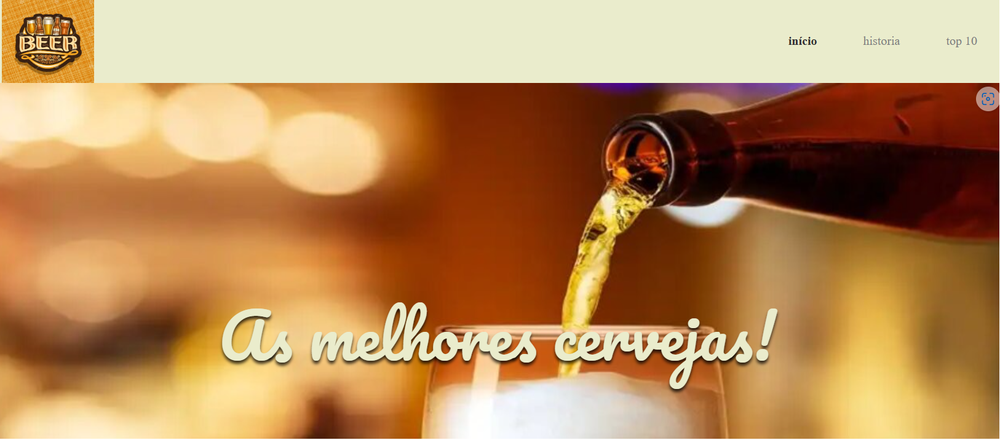

# Beer

A landing page Beer, é uma página responsiva meramente ilustrativa. A ideia principal desse projeto é evoluir ainda mais os conhecimentos em HTML e CSS.

## 🔨 Funcionalidades do projeto

O objetivo dessa página é representar as melhores cervejas atualmente, sem fins lucrativos.

## ✔️ Técnicas e tecnologias utilizadas

-`HTML`
-`CSS`
-`Acessibilidade Web`

## 🛠️ Abrir e rodar o projeto

Para abrir e rodar o projeto, utilize um editor de código de sua escolha.
Depois, abra o projeto no seu navegador.

## VERCEL 
https://beer-jade.vercel.app/
